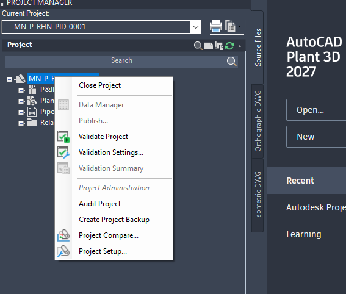
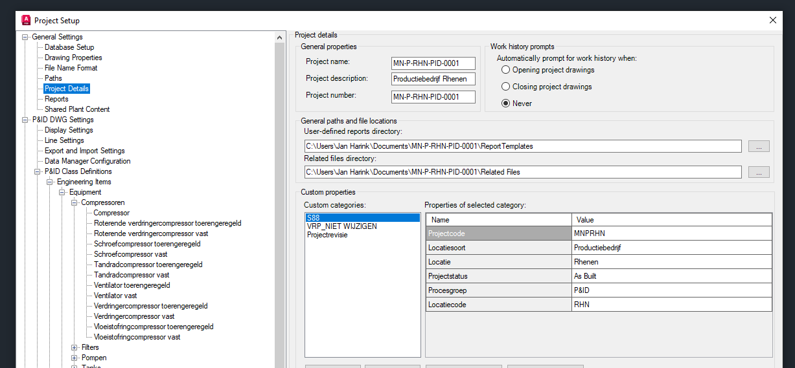
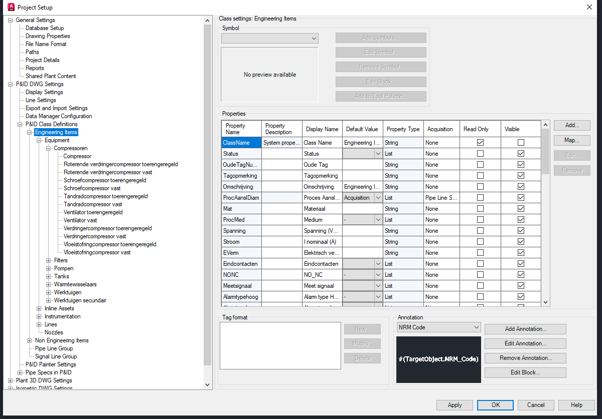

# EasyReportCreator — Customer Requirements

| Field | Value |
|---|---|
| Source document | `docs/EasyReportCreator.docx` |
| Converted on | 20 August 2026 |
| Customer | Jan |
| Sample project | `samples/MN-P-RHN-PID-0001` — Productiebedrijf Rhenen (Vitens PnId V6.1) |
| Product name | **EasyReportCreator** |

This Markdown file is a faithful conversion of the customer Word document, plus a structured interpretation of the three screenshots it contains.

---

## 1. Original customer text (from the Word document)

> In Plant 3D with Project Setup the project settings can be opened, but first you need to open the project.xml file.

> After this below menu is shown. From below General Setting (some standard and some user defined) the header data must be filled in.

> Also there are several class definitions for P&ID and Plant 3D, standard properties and user properties. All of these properties must be able to be selected by “EasyReportCreator”.

Screenshots included in the Word file (copied to `docs/images/`):

1. `01-project-manager.png` — how to open Project Setup from Project Manager  
2. `02-project-details.png` — Project Details / header source data  
3. `03-class-definitions.png` — P&ID Class Definitions / selectable properties  

---

## 2. Screenshot 1 — Opening Project Setup

**What the customer is showing**

- AutoCAD Plant 3D Project Manager, project `MN-P-RHN-PID-0001`
- Right-click the project → **Project Setup...**
- Related context: Data Manager, Validate Project, Audit Project, Create Project Backup

**Requirement implication**

EasyReportCreator must work from a Plant 3D project that has been set up this way. Opening/reading the project (via `project.xml` / project folder / `ProcessPower.dcf`) is the entry point.

---

## 3. Screenshot 2 — Header data from General Settings → Project Details

**What the customer is showing**

Path in Project Setup:

`General Settings → Project Details`

### Standard project fields (must feed the report header)

| Field | Sample value |
|---|---|
| Project name | `MN-P-RHN-PID-0001` |
| Project description | `Productiebedrijf Rhenen` |
| Project number | `MN-P-RHN-PID-0001` |

Also visible under General Settings tree (relevant for later phases): Database Setup, Drawing Properties, File Name Format, Paths, **Reports**, Shared Plant Content.

### Paths shown

| Path | Sample value |
|---|---|
| User-defined reports directory | `...\MN-P-RHN-PID-0001\Report Templates` |
| Related files directory | `...\MN-P-RHN-PID-0001\Related Files` |

### Custom properties (user-defined) — category `S88`

These are **user-defined** properties the customer explicitly wants available as header data:

| Property | Sample value |
|---|---|
| Projectcode | `MNPRHN` |
| Locatiesoort | `Productiebedrijf` |
| Locatie | `Rhenen` |
| Projectstatus | `As Built` |
| Procesgroep | `P&ID` |
| Locatiecode | `RHN` |

**Requirement implication (header)**

> From General Setting (some standard and some user defined) the header data must be filled in.

EasyReportCreator must:

1. Read **standard** Project Details fields.
2. Read **all user-defined / custom** project properties (e.g. S88 category and any other categories).
3. Let the user choose which of those fields appear in the issued list **header / title block**.
4. Support company logo + revision table together with that header data (from prior correspondence).

---

## 4. Screenshot 3 — Class definitions and selectable properties

**What the customer is showing**

Path in Project Setup:

`P&ID DWG Settings → P&ID Class Definitions → Engineering Items`

### Class hierarchy (examples visible)

- Engineering Items  
  - Equipment → Compressoren, Filters, Pompen, Tanks, Warmtewisselaars, Werktuigen, …  
  - Inline Assets  
  - Instrumentation  
  - Lines  
  - Nozzles  
  - (and further Plant 3D / P&ID class trees)

### Properties of selected class (Engineering Items) — examples

| Property Name | Display Name | Type | Notes |
|---|---|---|---|
| ClassName | Class Name | String | Read-only |
| Status | Status | List | Editable |
| OudeTagNummer | Oude Tag | String | |
| Tagopmerking | Tagopmerking | String | |
| Omschrijving | Omschrijving | String | |
| ProcAanslDiam | Proces Aansluitdiameter | List | Acquisition from Pipe Line Size |
| Mat | Materiaal | String | |
| ProcMed | Medium | List | |
| Spanning | Spanning (V) | String | |
| Stroom | Inominaal (A) | String | |
| EVerm | Elektrisch vermogen | String | |
| Eindcontacten | Eindcontacten | List | |
| NONC | NO_NC | List | |
| Meetsignaal | Meet signaal | List | |
| Alarmtypehoog | Alarm type Hoog | List | |

(Additional properties continue below the visible area of the screenshot.)

Also shown: Tag format, Annotation styles (example expression `#(TargetObject.NRM_Code)`).

**Requirement implication (columns / properties)**

> Also there are several class definitions for P&ID and Plant 3D, standard properties and user properties. All of these properties must be able to be selected by “EasyReportCreator”.

EasyReportCreator must:

1. Discover **P&ID and Plant 3D** class definitions from the project.
2. Expose **standard and user-defined** properties for each class.
3. Let the user **select any property** as a report column (not only a fixed hard-coded set).
4. Persist that selection in a saved **template / company standard**.

---

## 5. Consolidated requirements (Word doc + prior correspondence)

Combining this document with earlier messages from Jan:

| ID | Requirement | Source |
|---|---|---|
| R1 | Product name: **EasyReportCreator** | Word doc |
| R2 | Friendlier replacement for AutoCAD Report Creator | Chat |
| R3 | Produce several kinds of lists (valve, equipment, line, etc.) from Plant 3D database | Chat |
| R4 | Source of truth is the Plant 3D project / DCF (SQLite); SQL reader can open it | Chat + demo |
| R5 | Export and import of list data | Chat |
| R6 | User can create/save settings / templates as company standards | Chat |
| R7 | Header with company logo and revision table | Chat |
| R8 | Header fields filled from Project Setup → General Settings → Project Details (standard + user-defined) | Word doc |
| R9 | All P&ID and Plant 3D class properties (standard + user) selectable as report columns | Word doc |
| R10 | ICT support company may certify the application | Chat |

---

## 6. Gap analysis vs current demo

The existing demo already covers a large part of R2–R7 for fixed list types. Gaps highlighted by this Word document:

| Area | Current demo | Required by EasyReportCreator.docx |
|---|---|---|
| Product name | Previously branded PlantList | **EasyReportCreator** |
| Header source | Manual / template defaults | Auto-fill from Project Details + custom properties |
| Column selection | Fixed columns per template JSON | Dynamic selection from full class property catalogue |
| Class coverage | Selected queries (valves, equipment, lines, …) | Browse P&ID **and** Plant 3D class trees |
| User properties | Partially mapped (Vitens Dutch fields in Componentenlijst) | **All** standard + user properties selectable |
| Packaging / certification | Local web demo | **Web app** for V1 (local/intranet); ICT checklist still pending |

---

## 7. Acceptance criteria suggested for version 1

1. User opens a Plant 3D project folder; EasyReportCreator reads project identity and custom properties.
2. Report header can include selected Project Details / custom fields + logo + revision table.
3. User can pick a class (or list type) and choose any available property as a column.
4. Selection is saved as a reusable template.
5. Excel export/import works; original DCF is not overwritten without an explicit approved write-back policy.
6. At least the sample project `MN-P-RHN-PID-0001` is fully supported for P&ID lists.

---

## 8. Open points (still need customer confirmation)

These remain in `docs/RFI-001-Plant3D-List-Application.md`:

- Master deliverable (Componentenlijst vs valve/equipment/line lists)
- Whose logo / document number / paper size
- Write-back to live DCF vs Excel-only
- Deployment form (**web app agreed**; Windows installer optional later)
- P&ID only vs 3D in version 1
- Language (Dutch / English / both)

---

*Converted from `EasyReportCreator.docx` and interpreted against sample project `samples/MN-P-RHN-PID-0001` and prior correspondence in `reference/correspondence/Chat history.md`.*
